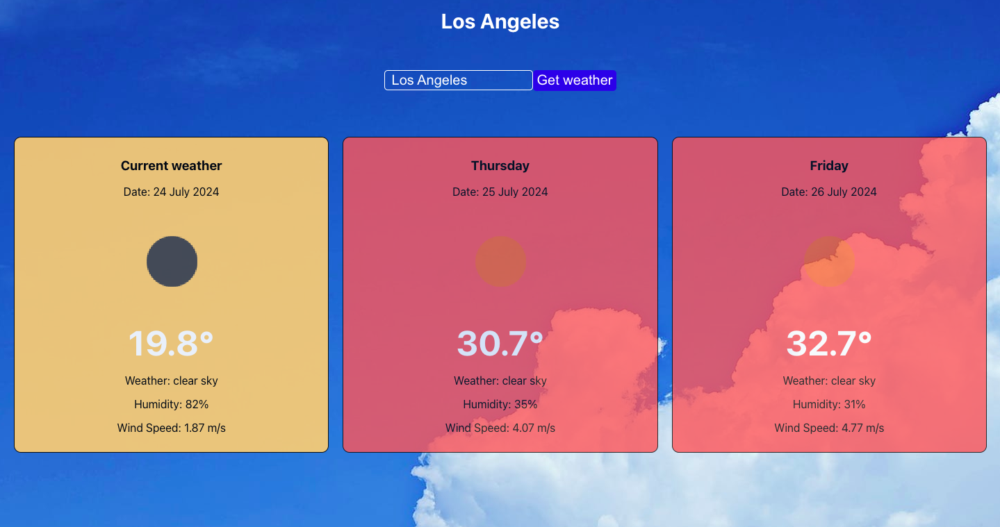

# Weather Forecast App

A simple and interactive weather forecasting app built with React. This application allows users to check the current weather and 3-day forecast for any city around the world. It features real-time data fetching, dynamic city search, and an intuitive user interface.



## Features

- **Current Weather:** Get the latest weather conditions for any city.
- **3-Day Forecast:** View a detailed weather forecast for the next five days.
- **Geolocation Support:** Automatically fetch weather data based on your current location.
- **Dynamic City Search:** Search for cities dynamically as you type.
- **Responsive Design:** Optimized for both desktop and mobile devices.

## Getting Started

### Prerequisites

Before you start, make sure you have the following installed:

- [Node.js](https://nodejs.org) (v14 or later)
- [npm](https://www.npmjs.com) (v6 or later)

### Installation

1. Clone the repository:

   ```bash
   git clone https://github.com/semenets/weather
   cd weather
   ```

2. Install the dependencies:

   ```bash
   npm install
   ```

3. Obtain an API key from [OpenWeatherMap](https://openweathermap.org) and add it to your environment variables:

   ```bash
   export REACT_APP_API_KEY=your_api_key
   ```

### Running the App

To start the application, use the following command:

```bash
npm start
```

This will launch the app on `http://localhost:3000`.

### Usage

- Enter the name of a city in the input field to get the current weather and forecast.
- The app will also try to fetch your current location's weather if you allow geolocation access.
- Click on a suggested city name from the dropdown to quickly select a city.
